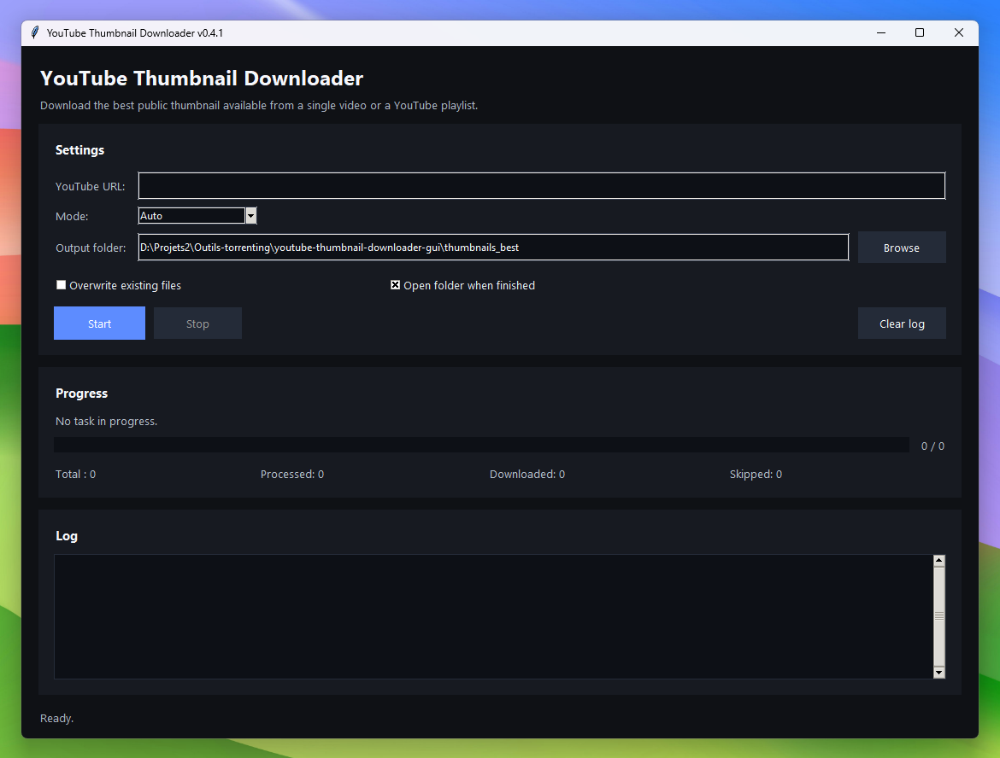
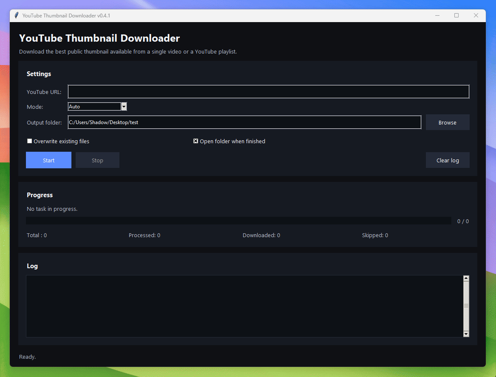

# YouTube Thumbnail Downloader GUI

<p align="center">
  
</p>

<p align="center">
  <strong>Modern Python desktop app to download the best public YouTube thumbnail from a single video or an entire playlist.</strong>
</p>

<p align="center">
  <a href="#features">Features</a> •
  <a href="#screenshots">Screenshots</a> •
  <a href="#installation">Installation</a> •
  <a href="#usage">Usage</a> •
  <a href="#build-a-windows-exe">Build</a> •
  <a href="#roadmap">Roadmap</a>
</p>

<p align="center">
  
  
  
  
</p>

## Overview

**YouTube Thumbnail Downloader GUI** is a clean and practical desktop application built with **Python**, **Tkinter**, **requests**, and **yt-dlp**. It lets you download the **best public thumbnail available** from:

- a single YouTube video
- a playlist
- Shorts links
- live URLs
- shortened `youtu.be` links

The application focuses on **speed, simplicity, and file organization**. It does **not download the videos** themselves: it only fetches the public thumbnail image in the best available quality.

## Features

- Modern desktop interface with a clean dark theme
- Supports **Auto**, **Single Video**, and **Playlist** modes
- Detects the URL type automatically when possible
- Downloads the **best available thumbnail** in priority order:
  - `maxresdefault`
  - `sddefault`
  - `hqdefault`
  - `mqdefault`
  - `default`
- Prioritizes modern image formats when available:
  - `webp`
  - `jpg`
- Real-time progress bar and processing status
- Integrated log panel
- Download statistics:
  - total
  - processed
  - downloaded
  - skipped
- Optional overwrite mode
- Optional automatic folder opening when finished
- Clean file naming with video ID included
- Playlist thumbnails stored in a dedicated subfolder

## Why this project is useful

This tool is useful for:

- content creators who want channel or video thumbnails quickly
- designers collecting visual references
- archivists documenting playlists
- developers who need a lightweight YouTube thumbnail utility
- users who want a **GUI alternative** instead of command-line scripts

## Screenshots

<p align="center">
  
</p>

## Project structure

```text
.
├── script.py
├── README.md
├── CHANGELOG.txt
├── LICENSE
├── .gitignore
├── requirements.txt
└── assets/
    ├── social-preview.png
    └── screenshot-main.png
```
.
├── script.py
├── README.md
├── CHANGELOG.txt
├── LICENSE
├── .gitignore
├── requirements.txt
└── assets/
    ├── social-preview.png
    └── screenshot-main.png
```

## Installation

### Requirements

- Python **3.11+** recommended
- `tkinter`
- `requests`
- `yt-dlp`

### Clone the repository

```bash
git clone https://github.com/<YOUR_GITHUB_USERNAME>/<REPO_NAME>.git
cd <REPO_NAME>
```

### Install dependencies

```bash
python -m pip install -r requirements.txt
```

Or manually:

```bash
python -m pip install -U requests yt-dlp
### Requirements

- Python **3.11+** recommended
- `tkinter`
- `requests`
- `yt-dlp`

### Clone the repository

```bash
git clone https://github.com/<YOUR_GITHUB_USERNAME>/<REPO_NAME>.git
cd <REPO_NAME>
```

### Install dependencies

```bash
python -m pip install -r requirements.txt
```

Or manually:

```bash
python -m pip install -U requests yt-dlp
```

## Usage

Run the application:
## Usage

Run the application:

```bash
```bash
python script.py
```

Then:

1. Paste a YouTube URL
2. Select a mode:
   - `Auto`
   - `Vidéo unique`
   - `Playlist`
3. Choose an output folder
4. Click **Lancer**

## Supported YouTube URLs

- `https://www.youtube.com/watch?v=...`
- `https://youtu.be/...`
- `https://www.youtube.com/shorts/...`
- `https://www.youtube.com/live/...`
- `https://www.youtube.com/playlist?list=...`

## Output examples

### Single video

```text
My chosen folder/
└── Amazing Video Title [VIDEO_ID].webp
```

### Playlist

```text
My chosen folder/
└── Playlist Name/
    ├── 001 - First Video Title [VIDEO_ID].webp
    ├── 002 - Second Video Title [VIDEO_ID].jpg
    └── 003 - Third Video Title [VIDEO_ID].webp
```

## Build a Windows `.exe`

Install PyInstaller:
Then:

1. Paste a YouTube URL
2. Select a mode:
   - `Auto`
   - `Vidéo unique`
   - `Playlist`
3. Choose an output folder
4. Click **Lancer**

## Supported YouTube URLs

- `https://www.youtube.com/watch?v=...`
- `https://youtu.be/...`
- `https://www.youtube.com/shorts/...`
- `https://www.youtube.com/live/...`
- `https://www.youtube.com/playlist?list=...`

## Output examples

### Single video

```text
My chosen folder/
└── Amazing Video Title [VIDEO_ID].webp
```

### Playlist

```text
My chosen folder/
└── Playlist Name/
    ├── 001 - First Video Title [VIDEO_ID].webp
    ├── 002 - Second Video Title [VIDEO_ID].jpg
    └── 003 - Third Video Title [VIDEO_ID].webp
```

## Build a Windows `.exe`

Install PyInstaller:

```bash
```bash
python -m pip install -U pyinstaller
```

Build:
Build:

```bash
```bash
pyinstaller --onefile --windowed script.py
```

Generated executable:
Generated executable:

```text
dist/script.exe
dist/script.exe
```

## Changelog

See the full history in [`CHANGELOG.txt`](./CHANGELOG.txt).

## Roadmap

- Add thumbnail preview before download
- Add multilingual interface
- Add drag-and-drop URL support
- Add export of download report
- Add custom file naming templates
- Add batch URL processing
- Add optional update checker

## Contributing

Suggestions, bug reports, and improvements are welcome.

If you want to contribute:

1. Fork the repository
2. Create a feature branch
3. Commit your changes
4. Open a pull request

## License

This project is distributed under the **MIT License**.

## Keywords

YouTube thumbnail downloader, YouTube thumbnail downloader GUI, Python YouTube thumbnail app, yt-dlp GUI, YouTube playlist thumbnail downloader, YouTube maxres thumbnail downloader, desktop thumbnail downloader, Tkinter YouTube downloader.

## Author

Replace this section with your name, links, and contact information:

- GitHub: `https://github.com/<YOUR_GITHUB_USERNAME>`
- Project: `https://github.com/<YOUR_GITHUB_USERNAME>/<REPO_NAME>`
## Changelog

See the full history in [`CHANGELOG.txt`](./CHANGELOG.txt).

## Roadmap

- Add thumbnail preview before download
- Add multilingual interface
- Add drag-and-drop URL support
- Add export of download report
- Add custom file naming templates
- Add batch URL processing
- Add optional update checker

## Contributing

Suggestions, bug reports, and improvements are welcome.

If you want to contribute:

1. Fork the repository
2. Create a feature branch
3. Commit your changes
4. Open a pull request

## License

This project is distributed under the **MIT License**.

## Keywords

YouTube thumbnail downloader, YouTube thumbnail downloader GUI, Python YouTube thumbnail app, yt-dlp GUI, YouTube playlist thumbnail downloader, YouTube maxres thumbnail downloader, desktop thumbnail downloader, Tkinter YouTube downloader.

## Author

Replace this section with your name, links, and contact information:

- GitHub: `https://github.com/<YOUR_GITHUB_USERNAME>`
- Project: `https://github.com/<YOUR_GITHUB_USERNAME>/<REPO_NAME>`
